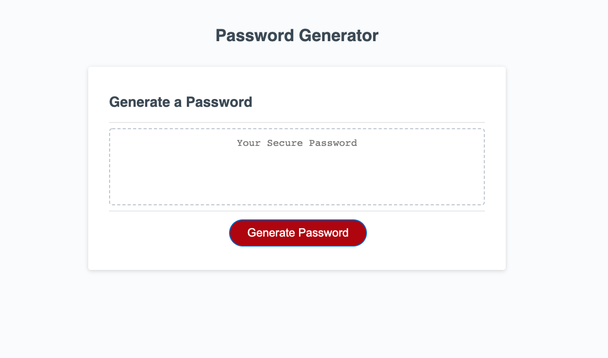

# Password Generator Starter Code

Third Assignment

# Generating a password for a user

## Description

The purpose of this challenge was to write JS code to allow a client to generate a password given certain parameters.

## Installation

Access code on github and run the website on a browser.

## Usage

Allows client to generate a random password given certain inputs.

## Credits

Ilya Feldman.

## License

None.
---

